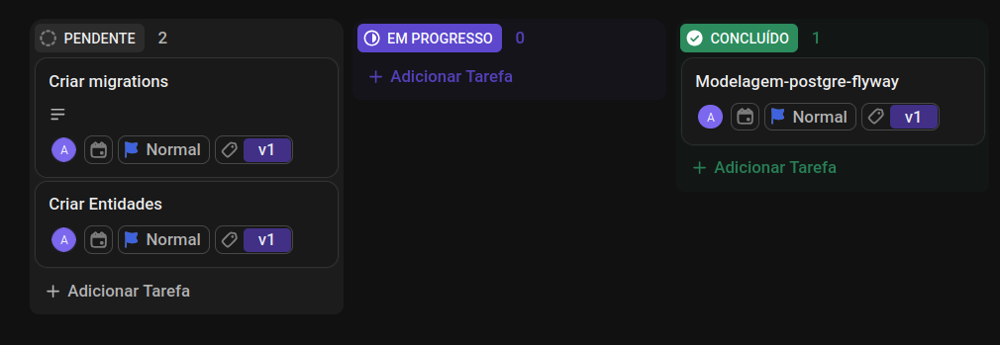

### PROCESSO SELETIVO CONJUNTO Nº 001/2026/SEPLAG e demais Órgãos - Engenheiro da Computação- Sênior
### PROJETO PRÁTICO - IMPLEMENTAÇÃO BACK END JAVA SÊNIOR
#### Número da inscrição: 16330
#### Perfil: ENGENHEIRO DA COMPUTAÇÃO - SÊNIOR
#### Candidato: 
    Abmael de Lima Ferreira
 #### Documentação
    RG: 3142129-6
#####
    cpf: 012.038.553-89
<!-- https://github.com/Ileriayo/markdown-badges -->
# Music

O **Music** é uma API REST que disponibiliza dados sobre **Artistas**  e  **Álbuns**.

---

## 📋 Sobre o Projeto

O **Music** é uma plataforma segura, pesquisas bem elaboradas; **Imagens**: permite efetuar upload de imagens;
Bem documentado
---

## 📚 Documentação Técnica

Para detalhes profundos sobre como o sistema foi construído, consulte nossos guias especializados:

- [📖 Introdução Geral](./docs/01-introducao.md)
- [🏗️ Arquitetura e Decisões (ADRs)](./docs/02-arquitetura.md)
- [📡 API REST e Contratos](./docs/04-api.md)
- [🧪 Estratégia de Testes (Unit & E2E)](./docs/pt-br/06-testes.md)
- [🗄️ Modelagem de Banco de Dados](./docs/pt-br/07-banco-dados.md)

---

## 🚀 Como Executar

### Passo a Passo Rápido
1.  **Clone o repositório:** `git clone https://github.com/Abmaellf/abmaeldelimaferreira012038.git`
2.  **Configuração:** Copie o `.env.example` para `.env` e ajuste suas chaves.
3.  **Docker:** Execute `./automation/run.sh` e escolha a opção **3**.

---

## 👨‍💻 Autor

Este projeto foi desenvolvido com dedicação por **Abmael de Lima Ferreira**.

- 🌐 **Portfolio/Links:** 
- 🐙 **GitHub:** [ https://github.com/Abmaellf ](https://github.com/Abmaellf)
- 💼 **LinkedIn:** [in/abmaelferreira](https://www.linkedin.com/in/abmaelferreira/)

###  👨 Metodologia de desenvolvimento
    Tarefas do projeto criadas via ClickUp
[https://app.clickup.com/9013176627/v/b/li/901324721568](https://app.clickup.com/9013176627/v/b/li/901324721568) 
###  👨 Histórico de commit
        JPA, Postgre, Flyway, .env, .env.exemplo, dockefile e docker-compose.
    
---

